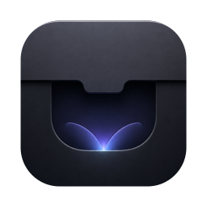

<p align="center">
  
</p>

<h1 align="center">CreativeNotch</h1>

<p align="center">
  Turn the MacBook notch into something useful — without the battery drain.
</p>

<p align="center">
  <a href="https://github.com/GcdZ03/CreativeNotch/actions/workflows/ci.yml">
    
  </a>
  
  
  
  
</p>

<!-- Screenshot goes here once there is UI worth showing. -->

---

## Why this exists

There are a dozen notch apps for macOS. The good ones share a flaw: they
poll. Global mouse monitors run continuously, system stats tick on timers,
audio visualisers run FFT on a live tap. Users report idle battery drain as
high as 5%/hour and memory leaks reaching 2 GB.

CreativeNotch inverts that with a single architectural commitment:

> **No subsystem runs when it isn't needed, and that rule is enforced
> centrally rather than trusted to each module.**

Everything else follows from it. Hover uses an `NSTrackingArea` on the panel
instead of a global monitor. Screen following listens for notifications
instead of tracking the cursor. The one subsystem that genuinely cannot
avoid polling — clipboard history, because `NSPasteboard` has no change
notification — is gated centrally on system activity rather than trusted to
behave.

This is a personal tool built for its author's own Macs. It is not
distributed, not sold, and not on the App Store.

---

## Status

**The foundation is complete. All five modules are built.**

| | |
|---|---|
| ✅ Panel anchored to the notch, or a pill on notchless Macs | Built |
| ✅ Hover to peek, click to open | Built |
| ✅ Follows the focused screen | Built |
| ✅ Menu bar item, first-launch onboarding | Built |
| ✅ **File shelf** — drag files in, drag them out | Built |
| ✅ **System HUD** — volume and brightness in the notch, alongside Apple's | Built |
| ✅ Media controls | Done |
| ✅ Clipboard history | Done |
| ✅ **Media metadata** — now-playing title, artist, artwork, and an ambient badge | Done |

The file shelf is the first working module. Drag a file onto the notch and
it opens to receive; drop it and the file is copied into the shelf; drag it
back out anywhere later.

The system HUD is the second. It shows volume and brightness feedback
wherever macOS gives none — Control Center, Siri, another app — and stays
silent for the physical keys, which macOS already covers with its own
overlay.

It draws into the **ears either side of the notch** — icon on the left,
level bar on the right — so nothing is ever hidden behind the camera
housing:

```
     ┌────┬─────────────┬──────┐
═════│ ☀  │   notch     │▓▓▓░░ │═════   menu bar
     └────┴─────────────┴──────┘
```

Notchless Macs get a single centred pill instead; there is no housing to
work around, so two empty ears would be worse.

It also ignores your **ambient light sensor**. Auto-brightness ramps the
backlight constantly, and those are real changes — measured on an M-series
MacBook doing nothing at all: 2301 events in one session. Changes smaller
than 0.005 in a single step are treated as the sensor rather than as you.
The trade-off is deliberate and worth knowing: a Control Center drag slower
than about three seconds moves in steps too small to register, so it will
not show.

Clipboard history is the third, and the only one that genuinely polls. Fifty
entries of text and images, in memory only and gone on quit, with the
pasteboard types password managers use to opt out honoured before any
content is read. It backs off when nothing is happening and suspends
entirely while the screen is locked or the machine is asleep.

Media controls are the fourth: play/pause, next and previous, sent through
the private MediaRemote framework to whatever application holds the media
session.

Media metadata is the fifth: the now-playing title, artist, and artwork,
shown above the transport buttons in the panel, in the ambient peek when
hovering the closed notch, and as a small album-cover badge beside the
closed notch while something is playing. The badge is deliberately
**static** — a looping equaliser would redraw continuously for as long as
music played, which is the exact cost this project exists to avoid.
Reading that information through
MediaRemote is gated by code-signing identifier, which this app cannot
satisfy directly — so the app spawns the system's own `perl`, signed as
`com.apple.perl`, and has it read Now Playing state on the app's behalf,
streaming the result back as newline-delimited JSON. The helper is
supervised with bounded restarts, started only while the screen is
unlocked and the machine is awake, and stopped the moment the app quits —
one subprocess is the budget for this project, and it never outlives it.

---

## Requirements

- **macOS 26 (Tahoe) or later.** There is no compatibility shim; the app
  targets 26 exclusively.
- **Apple Silicon or Intel.** Ad-hoc signing is applied either way (on
  Apple Silicon it is mandatory — an unsigned `arm64` binary will not
  launch at all).
- A physical notch is **not** required. Notchless Macs get a pill centred
  under the menu bar with identical behaviour.
- To build: **Xcode 26+** (or just the Command Line Tools — no `.xcodeproj`
  is used).

---

## Installation

```bash
curl -fsSL https://raw.githubusercontent.com/GcdZ03/CreativeNotch/main/Scripts/install.sh | bash
```

Installs to `/Applications`. Run the same command again to update — it
checks the installed version and exits early if you are current.

<details>
<summary>What that script does, before you pipe it to bash</summary>

Checks you are on macOS 26+, fetches the latest release from the GitHub API,
downloads the `.tar.gz`, verifies its code signature, stops any running copy,
and moves it into `/Applications`. It asks for `sudo` only if `/Applications`
needs it. Read it first if you like — it is
[`Scripts/install.sh`](Scripts/install.sh), and piping a script from the
internet into your shell deserves a look.

</details>

### Why `curl` rather than a download button

CreativeNotch is **ad-hoc signed, not notarised** — notarisation requires the
$99/yr Apple Developer Program, which this project deliberately does not use.

Browsers, Mail, Messages, and AirDrop stamp downloads with
`com.apple.quarantine`, and Gatekeeper refuses to open a quarantined app that
is not notarised. `curl` does not set that flag, so an install fetched this
way simply runs.

If you download the `.tar.gz` from the releases page by hand instead, strip
the flag yourself:

```bash
xattr -dr com.apple.quarantine /Applications/CreativeNotch.app
```

### Build from source

```bash
git clone https://github.com/GcdZ03/CreativeNotch.git
cd CreativeNotch
./Scripts/bundle.sh
open dist/CreativeNotch.app
```

Needs the Xcode Command Line Tools; a full Xcode install is not required, and
there is no `.xcodeproj`. A locally built app is never quarantined, so it runs
immediately.

### Permissions

On first launch an onboarding window explains that **Accessibility** access is
needed, and why: to notice when you press the volume or brightness keys, so
the HUD can stay quiet for them and leave Apple's own overlay alone.

Nothing else needs it. The file shelf's drag detection and drop target both
work through AppKit's own drag events, and clipboard history needs no
permission either. Without Accessibility the HUD still works, but it reacts
to the keys too — doubled feedback, not silence. You can skip the prompt and
grant it later from the menu bar item.

### Uninstalling

```bash
pkill -f CreativeNotch
rm -rf /Applications/CreativeNotch.app
defaults delete com.gcdz.creativenotch        # only exists after onboarding
```

Also remove CreativeNotch from **System Settings → Privacy & Security →
Accessibility** if you granted it.

The file shelf keeps its copies in
`~/Library/Application Support/CreativeNotch`. Removing the app leaves that
directory in place; delete it too if you want the stashed files gone.

## Usage

Launch the app. It has no Dock icon — it lives in the notch and the menu bar.

| Action | Result |
|---|---|
| Pause on the notch for ~300 ms | Peeks open |
| Move away | Collapses |
| Change volume from Control Center, Siri, or another app | Peeks a speaker icon and level bar |
| Change brightness from Control Center or another app | Peeks a sun icon and level bar |
| Press the volume or brightness keys | Apple's own HUD appears; the notch stays silent |
| Auto-brightness adjusts to the room | Nothing — the sensor is not you |
| Launch the app | Nothing; the current levels become the baseline |
| A device or route change re-reports the same mute state | Nothing; only an actual toggle shows |
| Drag the brightness slider very slowly (>3s end to end) | Nothing; the steps fall under the ambient noise floor |
| Drag a file onto the notch | Opens as a drop target; drop anywhere in the panel |
| Drag an item out of the shelf | Copies it wherever you drop it |
| Click the notch | Opens the full panel, on the tab you used last |
| Switch to the Clipboard tab | Shows what you have copied, newest first |
| Click a clipboard entry | Puts it back on the clipboard, ready to paste |
| Click it again | Closes it |
| Click the media buttons in the panel | Controls whatever is playing |
| Open the panel while something is playing | Title, artist, and artwork appear above the transport buttons |
| Something starts playing | A small album-cover badge appears beside the notch; it goes away when you pause |
| Hover the closed notch while something is playing | Peeks the now-playing track, with its cover; silent when paused |
| Click anywhere outside | Closes it |
| Switch to another app | Closes it |
| Move the cursor away | Closes it, after a 400 ms grace |
| Menu bar icon | Accessibility status, Clear Shelf, Clear Clipboard, Quit |

A quick cursor pass on the way to the menu bar does **not** trigger it — the
300 ms dwell is deliberate, because the notch sits directly on that path.

The panel is hidden entirely over fullscreen apps, so it never covers a film
or a presentation.

Quit from the menu bar item, or `pkill -f CreativeNotch`.

---

## Development

```bash
swift test           # 537 tests, ~1s, no window server needed
./Scripts/dev.sh     # stop, rebuild, sign, relaunch
```

Xcode opens `Package.swift` directly — there is no project file to maintain.

**Set up signing before touching any module that needs Accessibility.** An
ad-hoc signature's designated requirement is the hash of the code, so macOS
revokes your Accessibility grant on every rebuild. A one-time local
certificate fixes it:

```bash
./Scripts/setup-signing.sh
export CODESIGN_IDENTITY="CreativeNotch Dev"
```

### Project layout

```
Sources/
  CreativeNotchCore/   pure logic — geometry, hit-test shapes, state machine,
                       peek arbitration. Never imports AppKit or SwiftUI.
  CreativeNotchUI/     AppKit + SwiftUI — panel, hosting view, hover tracker,
                       menu bar, onboarding, app delegate.
  CreativeNotch/       18-line executable. Constructs the delegate and runs.
Tests/
  CreativeNotchCoreTests/   224 tests
  CreativeNotchUITests/     313 tests
```

The split is load-bearing, not cosmetic. `CreativeNotchCore` importing AppKit
or SwiftUI is a mistake: its freedom from them is what lets the geometry and
state logic run headlessly in CI in under a second.

Tests here are expected to **fail when the code is broken**, and that gets
verified rather than assumed — three tests shipped during the foundation
build that passed with their implementation deleted. When adding a test,
introduce the bug it targets, confirm it fails, then revert.

Full detail in [`docs/DEVELOPMENT.md`](docs/DEVELOPMENT.md).

## Roadmap

Every module on the *original* roadmap has shipped, and the first of the six
planned since — battery and power state. The remaining five are not built:

| | |
|---|---|
| **Battery and power state** — level, charging state, Low Power Mode | **Shipped** |
| **Preferences** — turn modules off, change the values that are compiled in today | Planned |
| **Launch at login** | Planned |
| **Global hotkey** — open the panel from anywhere | Planned |
| **Timer** — a countdown, counting down in the notch | Planned |
| **Capture indicators** — microphone, camera, and screen recording in use | Planned |

Battery shipped first, out of the suggested order — it needed no preferences
surface to be useful, and its tunables are documented constants that
Preferences can read later. Preferences comes next, because the remaining
four want somewhere to live and because retrofitting module enable/disable
costs more than building for it. Capture indicators come last: microphone and camera are reachable
through CoreAudio and CoreMediaIO property listeners, but **no public API
reports that another app is recording the screen**, so that third part may
not be buildable at all.

The one that is not merely unbuilt but genuinely unsettled is preferences,
for an architectural reason: turning a module off has to *stop its
subsystem*, not hide its UI. A switch that removes the feature while leaving
the poller running would be worse than no switch — the user pays for
something they explicitly declined.

Full analysis, including which need feasibility spikes first, is in
[`docs/ROADMAP.md`](docs/ROADMAP.md).

Each shipped module got its own spec and plan before any code. See
[`docs/specs/2026-08-25-system-hud-design.md`](docs/specs/2026-08-25-system-hud-design.md)
for the HUD's design, section 5.3 of
[`docs/specs/2026-08-22-creativenotch-design.md`](docs/specs/2026-08-22-creativenotch-design.md)
for the clipboard's, and
[`docs/specs/2026-08-29-media-metadata-design.md`](docs/specs/2026-08-29-media-metadata-design.md)
for media metadata, which supersedes the metadata half of that document's
section 5.4 — the transport half shipped unchanged.

The clipboard is the only subsystem that genuinely polls, and the reason
`SystemActivity` exists: a 50-entry in-memory ring, cleared on quit, with
`ConcealedType` / `TransientType` / `AutoGeneratedType` skipped before any
content is read. Text and images only — file URLs are left to the shelf.
Images are transcoded to PNG at capture, so an uncompressed retina
screenshot is judged at the size the ring will actually hold rather than
being silently dropped for exceeding the cap. It polls at 0.75s, backs off
to 3s after two quiet minutes, floors at 2s under Low Power Mode, and is
fully suspended while the screen is locked or the machine is asleep —
resuming resyncs without capturing whatever was copied in the meantime.

Deliberately **not** on the roadmap: an audio visualiser (it contradicts the
battery architecture), iCloud sync, a synthetic black notch on notchless
Macs, and the Mac App Store.

Before module work starts, see
[`docs/plans/2026-08-22-foundation-followups.md`](docs/plans/2026-08-22-foundation-followups.md)
— **F1** and **F2** are traps sitting directly in the file shelf's path.

---

## Documentation

| Document | What it covers |
|---|---|
| [`docs/ARCHITECTURE.md`](docs/ARCHITECTURE.md) | How it works, and the non-obvious parts |
| [`docs/DEVELOPMENT.md`](docs/DEVELOPMENT.md) | Dev loops, signing setup, release process |
| [`docs/ROADMAP.md`](docs/ROADMAP.md) | The six planned modules, and what each has to solve first |
| [`docs/specs/2026-08-22-creativenotch-design.md`](docs/specs/2026-08-22-creativenotch-design.md) | The design decisions and why |
| [`docs/specs/2026-08-22-file-shelf-design.md`](docs/specs/2026-08-22-file-shelf-design.md) | The file shelf module |
| [`docs/specs/2026-08-25-system-hud-design.md`](docs/specs/2026-08-25-system-hud-design.md) | The system HUD module |
| [`docs/specs/2026-08-29-media-metadata-design.md`](docs/specs/2026-08-29-media-metadata-design.md) | The media metadata module |
| [`docs/plans/2026-08-22-file-shelf.md`](docs/plans/2026-08-22-file-shelf.md) | How it was built |
| [`docs/plans/2026-08-22-foundation.md`](docs/plans/2026-08-22-foundation.md) | The foundation implementation plan |
| [`docs/plans/2026-08-22-foundation-followups.md`](docs/plans/2026-08-22-foundation-followups.md) | Known issues carried out of the build |
| [`docs/plans/2026-08-29-media-controls.md`](docs/plans/2026-08-29-media-controls.md) | How the transport controls were built |
| [`docs/plans/2026-08-29-media-metadata.md`](docs/plans/2026-08-29-media-metadata.md) | How the media metadata module was built |
| [`docs/research/2026-08-22-hud-feasibility.md`](docs/research/2026-08-22-hud-feasibility.md) | The feasibility spike behind the HUD module, and what it proved |
| [`docs/research/2026-08-29-media-feasibility.md`](docs/research/2026-08-29-media-feasibility.md) | The feasibility spike behind the media transport module, and what it proved |
| [`docs/research/2026-08-29-media-metadata-feasibility.md`](docs/research/2026-08-29-media-metadata-feasibility.md) | The feasibility spike behind the media metadata module, and what it proved |

---

## Acknowledgements

- [**The Boring Notch**](https://github.com/TheBoredTeam/boring.notch) —
  the open-source notch app this category owes most to, and the reference
  for how a project like this presents itself.
- [**mediaremote-adapter**](https://github.com/ungive/mediaremote-adapter) —
  the technique the now-playing metadata module depends on. Since macOS
  15.4 the `mediaremoted` daemon gates Now Playing reads by code-signing
  identifier; CreativeNotch works around it the same way, by running a
  helper through the system's own `perl`, which is signed as
  `com.apple.perl`. No SIP changes required.

---

## License

[GPL-3.0](LICENSE).

You may use, modify, and redistribute this, including commercially — but
derivative works must also be released under GPL-3.0. That is deliberate:
this category has a pattern of open work being repackaged as closed paid
apps, and the copyleft is there to prevent it.
